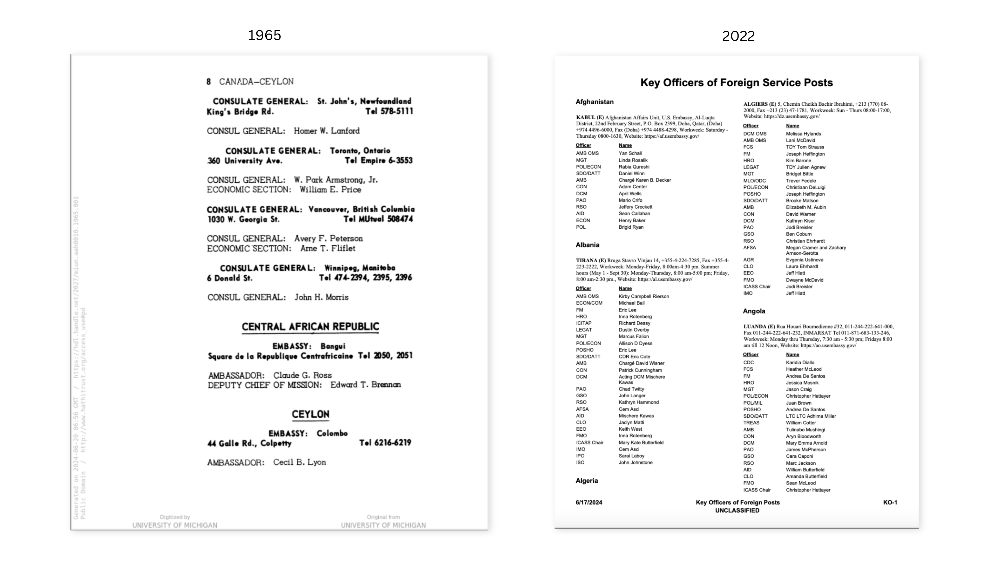
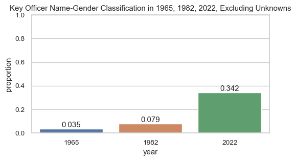

# dos-diversity: Examining gender representation in American diplomacy 

## Objective
This project utilizes a data extraction, cleaning, and analysis pipeline to to examine and visualize gender representation in the State Department directories in 1965, 1982, and 2022. I am most interested in the percentage of female officers overtime.

While this project only examines the State Department at three points in time, it can easily be scaled to analyze the State Department at a yearly granularity from 1965 to 2022.

## Data
My data source is the [State Department Key Officers of Foreign Service Posts](https://www.state.gov/wp-content/uploads/2019/10/Key-Officers.pdf) series of documents, publicly published from 1965 to 2022. The documents list the assigned officers and their positions for each US embassy. 

The data to be extracted generally takes the form of 'RANK(:) First M. Last Name'. Two excerpts of the data from 1965 and 2022 are displayed below. Find these PDFs in the `inst` folder. 

## Methods
In `code.ipynb` I design a data pipeline that completes the following tasks:

1. Imports and converts the directory PDF into text using the `PyMuPDF` PDF manipulation package.
2. Filters out information that does not include officer ranks or names, such as country names and page numbers, using text analysis tools such as `regex`.
3. Extracts officer rank and names, then uses `name_parser` package to extract first names.
4. Uses the `gender_guesser` first-name gender classification package to classify officer names.

## Results
The percentage of female officers at the State Department has increased by 30%, from only 3% in 1965 to nearly 35% in 2022. While this is still much lower than the global representation of female population, which sits at [nearly 50%](https://ourworldindata.org/gender-ratio#:~:text=around%20the%20world-,What%20share%20of%20the%20population%20is%20male%20and%20female%3F,ratio%2C%20vary%20around%20the%20world.), this demonstrates a significant improvement in gender equality in the State Department.

## Notes
Required Python packages include:
- pandas
- re
- pymupdf
- nameparser
- gender_guesser
- matplotlib
- seaborn

This project is a replication of fp21's [DOS diversity project](https://fsodiversity.web.app/), which examines the gender and racial diversity of State Department officers between 1965 to 2022. 
